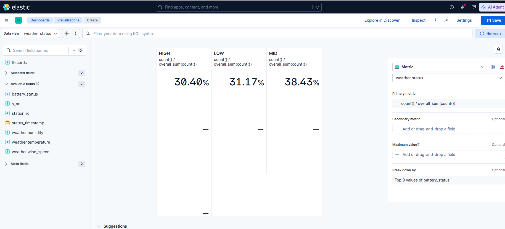
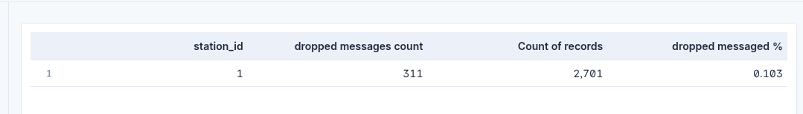

# Weather Stations Monitoring System

A distributed, stream-processing pipeline for IoT weather data.

---

## Table of contents

* [Architecture](#architecture)

  * [Weather stations](#weather-stations)
  * [Open-Meteo adapter](#open-meteo-adapter)
  * [Base central station](#base-central-station)
  * [Bitcask](#bitcask)
  * [Data analysis](#data-analysis)
* [Message schema](#message-schema)
* [Quick start (Docker Compose)](#quick-start-docker-compose)
* [Kubernetes deployment ](#kubernetes-deployment)
* [Kibana analyses](#kibana-analyses)

---

## Architecture


### Weather stations

Mock weather stations generate weather readings every second and publish them to Kafka. Each station has a unique station ID and randomly generated battery status and weather data. 10% of generated messages are intentionally dropped before publishing to simulate message loss.

### Open-Meteo adapter

The Open-Meteo adapter polls the [Open-Meteo](https://open-meteo.com/) API for current weather data and converts the response into the same Avro message format used by the mock weather stations before publishing it to Kafka.

### Base central station

The base central station is the main processing component of the system. It consumes weather data from Kafka and handles the downstream processing pipeline.

It detects rain events based on humidity, maintains the latest weather status for each station in Bitcask, and archives the complete stream of weather messages into Parquet files for further analysis in Elasticsearch and Kibana.

It also exposes the Bitcask store through a socket server, allowing clients to query the latest weather data for individual stations or all stored stations.

### Bitcask

Bitcask-style log-structured key-value store for maintaining the latest weather status of each station.

Records are appended using the format `keySize(4) | valueSize(4) | key | value`. When a segment reaches its size limit, a new segment is created.

A background merge process periodically compacts immutable segments by retaining only the latest entry for each key and removing outdated records. The merge also generates `.hint` files containing the key locations in the merged segment. During recovery, these hint files allow the key directory to be rebuilt without scanning the complete data files, reducing startup time.

### Data analysis

All incoming weather messages are archived as Parquet files and later ingested into Elasticsearch. Kibana is used to analyze the collected data, including battery status distribution and dropped messages per station.

## Message schema

Defined in `Common` (`AvroWeatherStatusMessage`):

| Field                       | Type   | Notes                                                  |
| --------------------------- | ------ | ------------------------------------------------------ |
| `stationId`                 | long   | 1–10 for mock stations, 100 for the Open-Meteo adapter |
| `sequenceNumber`            | long   | Increments per message; gaps reveal dropped messages   |
| `batteryStatus`             | enum   | `LOW`, `MID`, `HIGH`, `NOT_AVAILABLE`                  |
| `statusTimeStamp`           | long   | Unix epoch **milliseconds**                            |
| `weatherStatus.humidity`    | int    | Percentage                                             |
| `weatherStatus.temperature` | double | Fahrenheit                                             |
| `weatherStatus.windSpeed`   | double | km/h                                                   |

Rain events (`AvroRainMessage`) contain `stationId` and `humidity`.

## Quick start (Docker Compose)

The fastest way to run the whole system. One command starts Kafka, Schema Registry, the Open-Meteo adapter, 10 mock weather stations, and the base central station.

**Prerequisites:** [Docker](https://docs.docker.com/get-docker/) with the Compose plugin (`docker compose version` should work).

```bash
git clone https://github.com/Momensamir12/Weather-Stations-Monitoring-System.git
cd Weather-Stations-Monitoring-System

docker compose up --build -d
```

Check that everything is running:

```bash
docker compose ps
docker compose logs -f base-central-station
```

Stop the system:

```bash
docker compose down
```


### Configuration

Services are configured through environment variables, set in `docker-compose.yml`:

| Service                | Variable               | Description                              |
| ---------------------- | ---------------------- | ---------------------------------------- |
| all                    | `KAFKA_BOOTSTRAP_SERVER` | Kafka bootstrap address (`broker:29092` inside Compose) |
| all                    | `SCHEMA_REGISTRY_URL`  | Schema Registry URL                      |
| weather stations       | `STATION_ID`           | Unique station ID (1–10)                 |
| open-meteo adapter     | `OPEN_METEO_URL`       | Open-Meteo API endpoint                  |
| base central station   | `BITCASK_DATA_DIR`     | Directory for Bitcask segments           |
| base central station   | `PARQUET_OUTPUT_DIR`   | Directory for archived Parquet files     |

### Output data

The base central station writes to `./data` on the host (mounted at `/data` in the container):

* `data/bitcask/`: Bitcask segments and `.hint` files
* `data/parquet/`: archived weather messages

## Kubernetes deployment 


**Prerequisites:** Docker, `kubectl`, and a Kubernetes cluster such as Minikube or Kind.

Run the deployment script from the repository root:

```bash
./scripts/deploy.sh
```

The script builds the Docker images, loads them into the Kubernetes cluster, deploys Kafka and Schema Registry, and then starts the weather stations, Open-Meteo adapter, and base central station.


## Kibana analyses

The weather data stored in Elasticsearch is analyzed in Kibana to validate the behavior of the simulated weather stations.

### Battery status distribution

The battery status distribution approaches the specified 30% low, 40% medium, and 30% high distribution as more messages are collected.



### Dropped messages per station

10% of generated weather-station messages are intentionally dropped before being published to Kafka. The resulting sequence-number gaps are used to determine the dropped-message rate.



