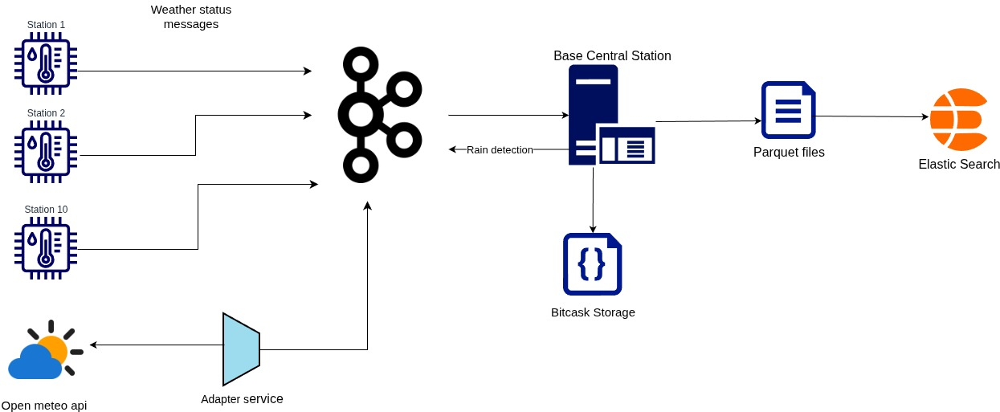

# Weather Stations Monitoring System

A distributed, stream-processing pipeline for IoT weather data.

---

## Table of contents

* [Architecture](#architecture)
* [Repository layout](#repository-layout)
* [Message schema](#message-schema)
* [Components](#components)

  * [Weather station (mock)](#weather-station-mock)
  * [Open-Meteo adapter (bonus)](#open-meteo-adapter-bonus)
  * [Base central station](#base-central-station)
  * [Bitcask](#bitcask)
  * [Parquet archive and Elasticsearch ingestion](#parquet-archive-and-elasticsearch-ingestion)
* [Build and run](#build-and-run)
* [Kubernetes deployment](#kubernetes-deployment)
* [Querying Bitcask](#querying-bitcask)
* [Kibana analyses](#kibana-analyses)

---

## Architecture



The three stages required by the specification map onto the diagram as follows:

* Mock weather stations send weather status messages to Kafka every second.
* The Open-Meteo adapter polls current weather data from the Open-Meteo API and forwards it to Kafka.
* The base central station:

  * detects rain by checking for weather messages with humidity above 70%;
  * maintains an up-to-date view of each station's latest weather status in Bitcask, using the station ID as the key;
  * maintains a history of weather messages by writing all incoming messages to Parquet files, which can then be ingested into Elasticsearch and analyzed in Kibana.

## Repository layout

```text
.
├── Common/                  Shared library: Avro schemas, KafkaConfig, ManagedService, AppBootstrap
├── Bitcask/                 Bitcask key-value store (library)
├── WeatherStation/          Mock weather station (one instance per station ID)
├── OpenMeteoAdapter/        Channel adapter: Open-Meteo REST API → Kafka
├── BaseCentralStation/      Rain detection, Bitcask consumer, Parquet archiver, Bitcask server
├── docker/                  Container/cluster support files
├── kubernetes/              Kubernetes manifests
├── scripts/
│   ├── bitcask_client.sh
│   ├── bitcask_client.py
│   ├── deploy.sh
│   ├── elasticsearch_job.py
│   └── write-path-profiler.py
└── pom.xml                  Parent POM (Maven multi-module reactor)
```

## Message schema

Defined in `Common` (`AvroWeatherStatusMessage`):

| Field                       | Type   | Notes                                                  |
| --------------------------- | ------ | ------------------------------------------------------ |
| `stationId`                 | long   | 1–10 for mock stations, 100 for the Open-Meteo adapter |
| `sequenceNumber`            | long   | Increments per message; gaps reveal dropped messages   |
| `batteryStatus`             | enum   | `LOW`, `MID`, `HIGH`, `NOT_AVAILABLE`                  |
| `statusTimeStamp`           | long   | Unix epoch **milliseconds**                            |
| `weatherStatus.humidity`    | int    | Percentage                                             |
| `weatherStatus.temperature` | double | Fahrenheit                                             |
| `weatherStatus.windSpeed`   | double | km/h                                                   |

Rain events (`AvroRainMessage`) contain `stationId` and `humidity`.

> **Timestamp units:** `statusTimeStamp` is expressed in milliseconds everywhere: the producers, the Parquet partitioner (`Instant.ofEpochMilli`), and the Elasticsearch mapping (`epoch_millis`). Mixing units can silently place records far outside their intended time range, so all consumers must use the same unit.

## Components

### Weather station (mock)

`WeatherStation` emits a reading every second. Battery status follows the distribution specified by the requirements: 30% low, 40% medium, and 30% high.

10% of generated messages are dropped before publishing, so sequence-number gaps can be used to measure the drop rate downstream.

Randomness and time are provided through injected `RandomNumberGenerator` and `Clock` interfaces, making the behavior deterministic during testing.

Each station runs as its own Kubernetes Deployment with a distinct `STATION_ID`.

### Open-Meteo adapter (bonus)

`OpenMeteoAdapter` polls the [Open-Meteo](https://open-meteo.com/) current-weather endpoint for a fixed coordinate and translates the response into the same Avro message format used by the mock stations.

Fields that the API cannot provide are handled explicitly:

* `stationId`: a reserved ID (`100`) outside the mock stations' range.
* `sequenceNumber`: an in-memory counter that restarts when the service restarts. Drop-rate calculations should therefore be performed per continuous run.
* `batteryStatus`: `NOT_AVAILABLE`, because an API-backed feed has no battery information.

The polling interval is configurable. Because real weather does not change every second, polling much less frequently than the 1 Hz mock-station rate is both more appropriate for the data and more respectful of the free API.

### Base central station

| Service                            | Mechanism                                 | Output                     |
| ---------------------------------- | ----------------------------------------- | -------------------------- |
| `KafkaStreamsRainDetectionService` | Kafka Streams filter + map                | `rain-events` topic        |
| `BitcaskConsumerService`           | `KafkaConsumer`, group `bitcask-writer`   | Bitcask store              |
| `ParquetArchiverService`           | `KafkaConsumer`, group `parquet-archiver` | Parquet files              |
| `BitcaskServer`                    | Socket server on `:9090`                  | Serves reads to the client |

### Bitcask

Implementation of a Bitcask-style log-structured key-value store.

* **Write path:** Records are appended to a single active segment file using the format `keySize(4) | valueSize(4) | key | value`. The active file rotates at 1 MB.
* **Compaction (merge):** A background process reclaims disk space by removing outdated, overwritten, or deleted key-value entries from immutable data files.
* **Hint files:** Merged segments receive a `.hint` file, allowing the key directory to be rebuilt during startup by reading small hint files instead of scanning the complete data files.
* **Recovery:** On startup, the key directory is rebuilt from hint files where available and from data files otherwise.

### Parquet archive and Elasticsearch ingestion

The base central station writes incoming weather messages to Parquet files. The Elasticsearch ingestion job reads these files and indexes the records into Elasticsearch, where they can be explored and analyzed using Kibana.

## Build and run

**Prerequisites:** JDK 25, Maven 3.9+, Docker, `kubectl`, and a Kubernetes cluster such as Minikube or Kind. Python 3 with `pyarrow` and `elasticsearch` is required for the Elasticsearch ingestion job.

```bash
# Build every module
mvn clean install
```

Each service is packaged as a fat JAR using the Maven Shade plugin:

```text
<Module>/target/<Module>-1.0.0.jar
```

### Container images

The Docker build context is the repository root because each Dockerfile needs access to the parent POM and shared modules:

```bash
docker build -f WeatherStation/Dockerfile      -t weather-station:latest .
docker build -f OpenMeteoAdapter/Dockerfile    -t open-meteo-adapter:latest .
docker build -f BaseCentralStation/Dockerfile  -t base-central-station:latest .
```

## Kubernetes deployment

From the repository root:

```bash
./scripts/deploy.sh
```

The deployment script supports Kind, Minikube, or an external registry:

```bash
./scripts/deploy.sh
```

```bash
KIND_CLUSTER_NAME=dev ./scripts/deploy.sh
```

```bash
CLUSTER=minikube ./scripts/deploy.sh
```

```bash
CLUSTER=none ./scripts/deploy.sh
```

To skip rebuilding and reloading container images:

```bash
SKIP_BUILD=true ./scripts/deploy.sh
```

To verify the deployment:

```bash
kubectl get pods
kubectl get pv,pvc
```

To follow the base central station logs:

```bash
kubectl logs -f -l app=base-central-station
```

## Querying Bitcask

With the base central station running locally, or exposed through port forwarding:

```bash
kubectl port-forward deployment/base-central-station-deployment 9090:9090
```

Run the client from the repository root:

```bash
./scripts/bitcask_client.sh --view-all
./scripts/bitcask_client.sh --view --key=3
./scripts/bitcask_client.sh --perf --clients=100
```

`--view-all` writes all keys and their latest values to `<timestamp>.csv`.

Values are stored as JSON text, so they can be read without Avro or Schema Registry.

## Kibana analyses

Two analyses validate the simulation against the requirements:

1. **Battery status distribution per station**

   The observed distribution should approach 30% low, 40% medium, and 30% high.

2. **Dropped messages per station**

   The observed drop rate should approach 10%.

   Dropped messages never reach Kafka, so they are derived from sequence numbers:

   ```text
   dropped = (max(seq) - min(seq) + 1) - indexed_count
   ```

   This calculation should be performed per continuous run (for example, per day or per service run), because the sequence number resets when a weather-station service restarts.
